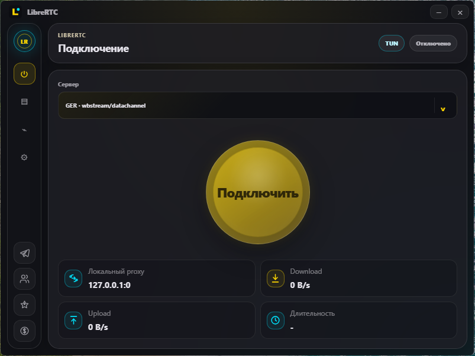
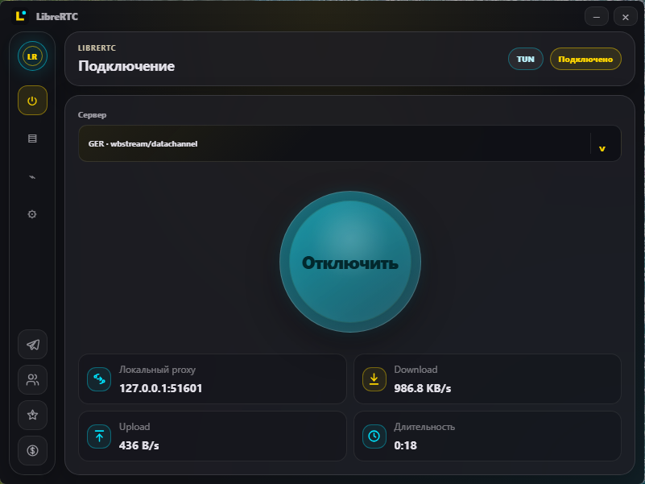
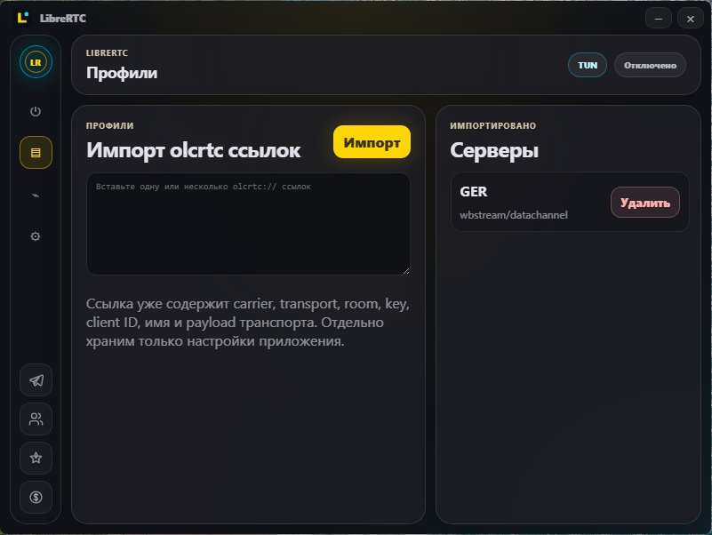
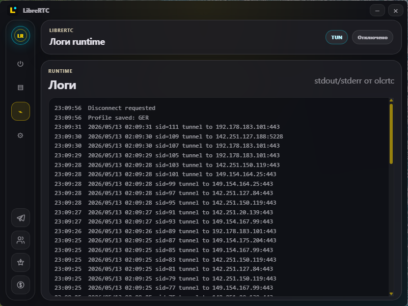
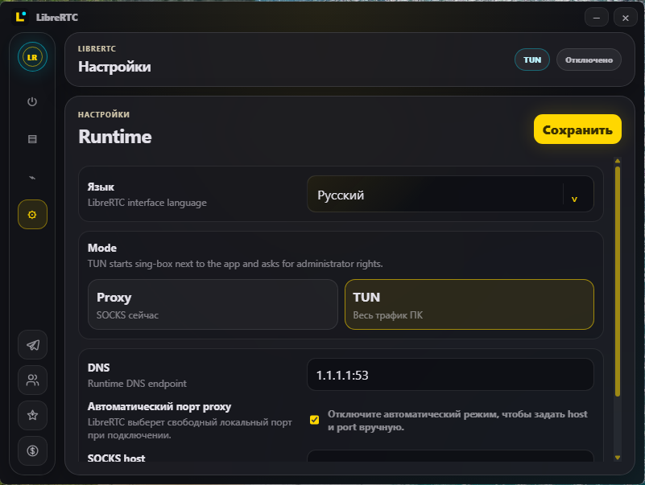

<p align="center">
  
</p>

<h1 align="center">LibreRTC Client</h1>

<p align="center">
  Лёгкий Windows-клиент для LibreRTC, сделанный для работы по протоколу `olcrtc`, с Proxy и TUN режимами, системным tray, реальной телеметрией трафика и встроенным TUN-сервисом на sing-box.
</p>

<p align="center">
  
  
  
  
</p>

<p align="center">
  <a href="#скриншоты">Скриншоты</a> ·
  <a href="#что-это">Что это</a> ·
  <a href="#возможности">Возможности</a> ·
  <a href="#сборка">Сборка</a> ·
  <a href="#безопасность">Безопасность</a>
</p>

<table align="center">
  <tr>
    <td align="center" width="760">
      <h3>Поддержка и сообщество</h3>
      <p>Поддержать разработку, следить за обновлениями или присоединиться к обсуждению LibreRTC.</p>
      <table align="center">
        <tr>
          <td align="center" width="350"><a href="https://t.me/tribute/app?startapp=dK9j"></a></td>
          <td align="center" width="350"><a href="https://nowpayments.io/donation/svllvsx"></a></td>
        </tr>
        <tr>
          <td align="center" width="350"><a href="https://t.me/svllvsxprod"></a></td>
          <td align="center" width="350"><a href="https://t.me/openlibrecommunity"></a></td>
        </tr>
      </table>
    </td>
  </tr>
</table>

## Скриншоты

<p align="center">
  
  
  
  
  
</p>

## Что это

LibreRTC Client импортирует `olcrtc://` профили и запускает локальное подключение к LibreRTC node без ручной настройки runtime-компонентов пользователем.

Клиент сделан как небольшой desktop control-plane для LibreRTC: пользователь выбирает профиль, нажимает переключатель подключения, а приложение само запускает локальный runtime, выбирает свободный proxy port, следит за состоянием процесса и показывает текущую скорость download/upload. Интерфейс не раскрывает внутренние room/key/client payload значения и не требует вручную указывать путь к runtime binary.

Клиент поддерживает два режима:

- Proxy: запускает `olcrtc.exe` и поднимает локальный SOCKS proxy.
- TUN: запускает `olcrtc.exe`, затем направляет системный трафик через `librertc-net-service.exe` со встроенным sing-box engine.

Proxy mode подходит для приложений, где можно вручную указать SOCKS proxy. TUN mode нужен для системного маршрута: клиент поднимает локальный SOCKS через `olcrtc`, а Windows service запускает embedded sing-box и направляет трафик через TUN interface. В TUN режиме системный proxy Windows не включается, чтобы браузеры и приложения работали напрямую через маршруты.

Приложение хранит пользовательские настройки и импортированные профили в `%LOCALAPPDATA%\LibreRTC\client`. Tray используется для скрытия окна и быстрого управления подключением; закрытие окна не завершает приложение сразу, а отправляет его в tray.

Runtime-компоненты ожидаются рядом с `librertc-client.exe`: сам клиент, `olcrtc.exe` и `librertc-net-service.exe`. Service устанавливается через UAC только когда нужен TUN режим и остаётся установленным после отключения; disconnect останавливает tunnel engine, но не удаляет service.

## Возможности

- Импорт и хранение нескольких LibreRTC профилей.
- Proxy режим с автоматическим выбором свободного локального порта.
- TUN режим через Windows service и embedded sing-box.
- Реальная телеметрия download/upload из runtime-статистики `olcrtc`.
- RU/EN интерфейс.
- Fixed-size frameless UI, custom titlebar и tray controls.
- Внешние ссылки открываются только через системный браузер.
- Локальный Inter Regular font bundle, без web-font ссылок.

## Как это работает

1. Пользователь импортирует один или несколько `olcrtc://` профилей.
2. Клиент сохраняет профили локально и показывает их в dropdown на главном экране.
3. При подключении backend запускает `olcrtc.exe` с выбранным профилем и включает stats interval.
4. Frontend читает `OLCRTC_STATS` из stdout runtime и обновляет виджеты скорости/длительности.
5. В Proxy mode приложение сообщает локальный SOCKS endpoint.
6. В TUN mode backend дополнительно запускает/использует `LibreRTCNetService`, который поднимает TUN и маршруты через embedded sing-box.
7. При отключении клиент останавливает runtime и TUN engine, очищает состояние UI и оставляет tray/service в безопасном состоянии.

## UI и поведение

- Основной экран сфокусирован на выборе сервера и подключении.
- Logs вынесены в отдельную вкладку, чтобы не мешать основному flow.
- Settings содержит режим работы, DNS и ручные настройки local SOCKS.
- Закрытие окна скрывает приложение в tray; quit доступен из tray menu.

## Архитектура

```text
Windows desktop app
  -> Tauri UI
  -> Rust backend commands
  -> olcrtc.exe local SOCKS runtime
  -> optional LibreRTCNetService TUN bridge
  -> LibreRTC node
```

TUN service остаётся установленным после отключения. Disconnect останавливает только embedded tunnel engine.

## Требования

- Windows 10/11.
- WebView2 Runtime.
- Rust stable toolchain.
- Node.js и npm.
- Go toolchain для пересборки `librertc-net-service.exe`.
- `olcrtc.exe` рядом с release `librertc-client.exe` во время запуска.

## Сборка

Установить frontend dependencies:

```bash
npm install
```

Собрать frontend:

```bash
npm run build
```

Собрать Tauri-клиент:

```bash
npm run tauri -- build
```

Собрать TUN service:

```bash
cd librertc-net-service
go build -tags with_gvisor -ldflags "-H=windowsgui" -o ../src-tauri/target/release/librertc-net-service.exe ./cmd/librertc-net-service
```

Runtime-файлы рядом с `librertc-client.exe`:

```text
librertc-client.exe
librertc-net-service.exe
olcrtc.exe
```

## Структура

```text
src/                    TypeScript UI, styles, local assets
src-tauri/              Rust Tauri backend and Windows shell integration
librertc-net-service/   Go Windows service with embedded sing-box
screens/                Screenshots and README assets
```

## Безопасность

- Live `olcrtc://` профили не коммитятся.
- Runtime profile хранится в `%LOCALAPPDATA%\LibreRTC\client`.
- Build outputs, binaries, local imports и profile files исключены из git.
- Внешние ссылки проходят через strict backend allowlist.
- В текущем MVP TUN режим блокирует IPv6, чтобы избежать leak.

## Теги

`librertc` `vpn-client` `tauri` `rust` `typescript` `windows` `tun` `sing-box` `socks-proxy` `webrtc`

## Примечание

Этот репозиторий содержит только desktop client. Core runtime и server node ведутся отдельно в рамках LibreRTC.
